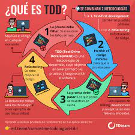

# Testing Driven Development

Test-Driven Development (TDD) is a technique for building software that guides software development by writing test. (Martin Fowler's definition)

"**Test** Drivin **Development**" is NOT primarily about testing or development (i.e., coding)

- It is rather about design - where design is evolved through refactoring.

Developers write unit tests (NOT testers) and then coding.

## TDD? But I already write unit tests!

In Test Driven Development, test mean "unit tests" (Note that in variations/extensions such as ATDD, tests are not unit tests)

Just because unit tests are written in a team doesn't mean they follow TDD - they could be written even after the writing code - that is Plain Old Unit testing (POUting)

However, when following Test Driven Development or Test _First_ Development approach we write the tests first before actually writting the code.

## TDD mantra

- Red: write a little test that doesn't work, perhaps doesn't even compile at first
- Green: make the test work quickly, commitigin whatever sins necessary in the process
- Refactor: eliminarie all the diplication and smells created in just getting the test to work

## 3 Laws of TDD

1. You may not write production code unless you've first written a failing unit test.
2. You may not write more of a unit test tha is sufficient to fail.
3. You may not write more production code that sufficient to make the failing unit test pass

# TDD benefits

- Better design
- Cleaner code (because of refactoring)
- Safer refactoring
- Increased quality
- Better code coverage
- Tests serve a documentation
- Faster debugging
- Most often, the falling code/test in the most recently changed code
- Self-documenting tests
- Test-cases show/indicate how to use the code
